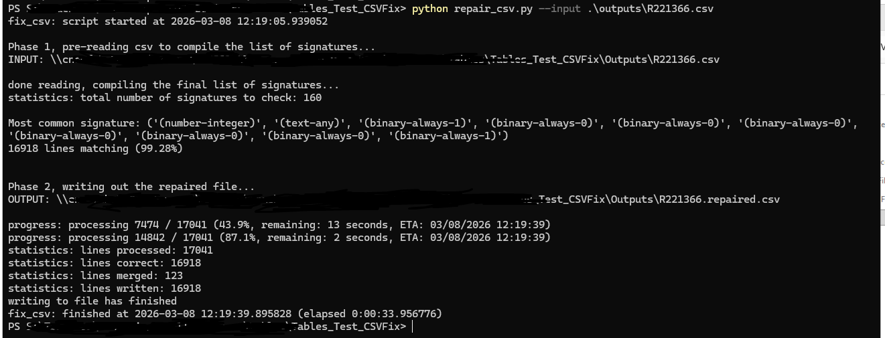

# Repair-CSV
The tool designed to repair line breaks in CSV files.

This happens when CSV is generated from SPSS that includes open-ends, and there are line breaks in user responses in the data. This happens in the middle of the line. As CSV is a super simple text format, it breaks the line, it breaks the file. I don't have a good asnwer why this is not solved at tool level, and cell contents with line breaks are not wrapped with double quotes, that should address the issue. Anyway, this is a common problem.

So, here is the script. You just run it, and it fixes the file. It identifies the common signature for line starts, and merges line that do not follow the pattern.

Actually, all what is happening is very clear from the outputs.

So, just run and enjoy. Distribution includes the bat file, so just open and and adjust the path to your file. There is a "pause" statement at the end. That's it.

See details on the screenshot.

